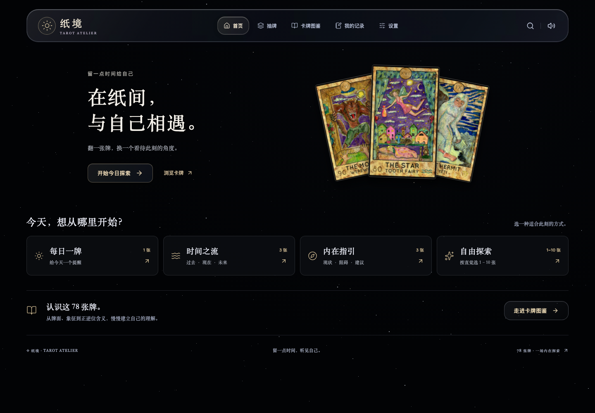
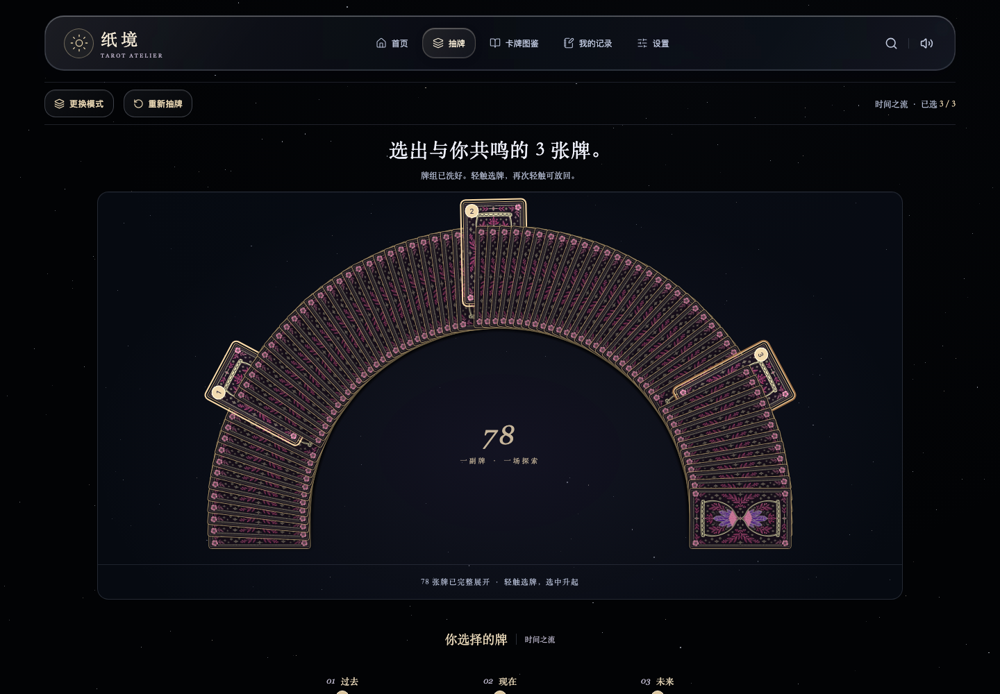
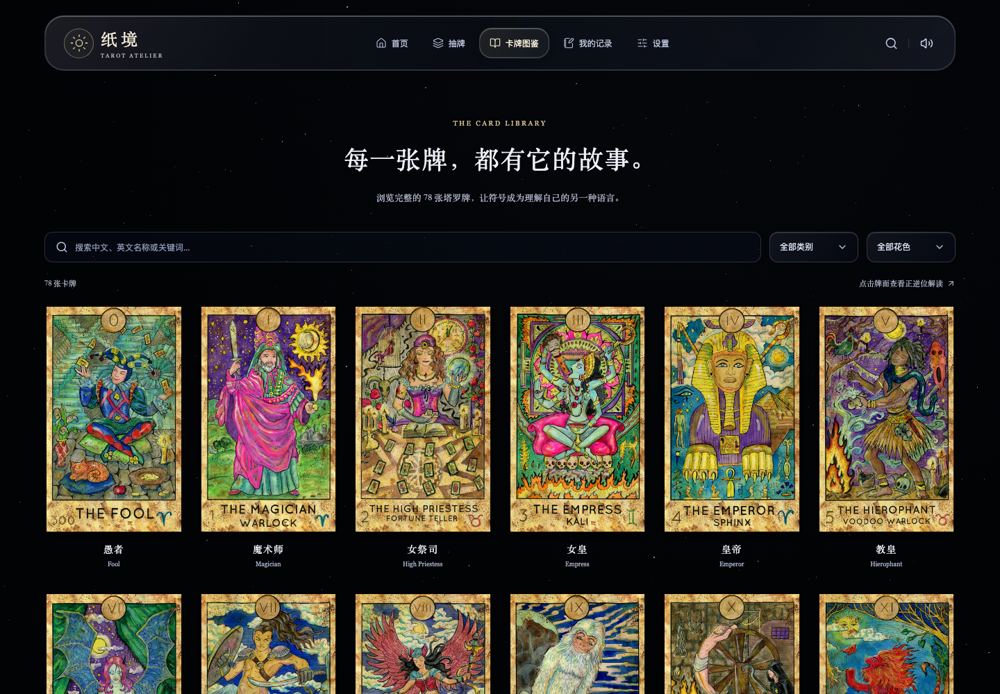
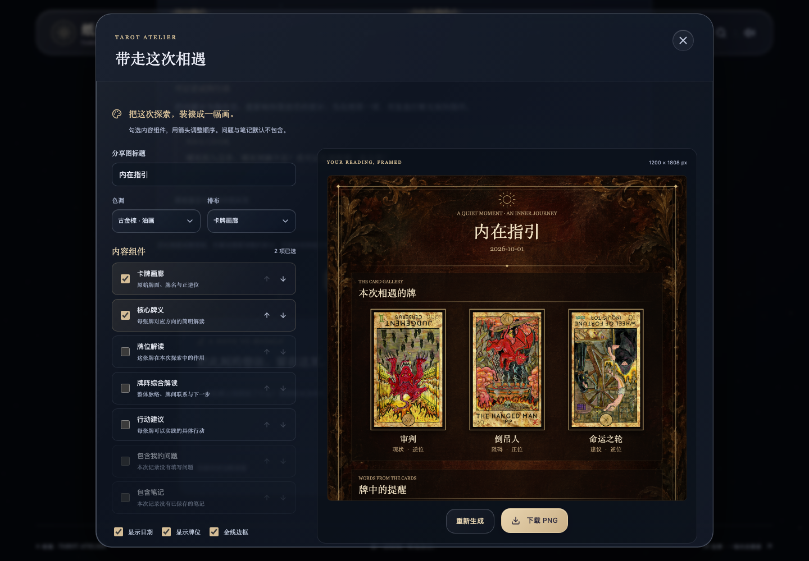

# 纸境 · Tarot Atelier

留一点时间，在纸间与自己相遇。

纸境是一款支持电脑和手机浏览器的塔罗抽牌网页。近黑星空、半透明玻璃界面与复古牌面构成安静的探索空间；从洗牌、选牌到解读与笔记，都可以按自己的节奏完成。

项目采用 **Python / FastAPI + React / TypeScript**，提供完整 78 张牌组、四种抽牌模式、本地记录和离线使用。无需账号，个人问题与笔记保存在当前浏览器。

[项目预览](#项目预览) · [主要功能](#主要功能) · [安装与启动](#安装与启动) · [使用说明](#使用说明) · [开发文档](#开发文档)

仓库：[sakura-chh/Tarot](https://github.com/sakura-chh/Tarot)。当前版本可在本机运行，尚未部署公开在线演示。

## 项目预览

以下为当前版本的实际网页截图（桌面 1440 × 1000），点击图片可查看原图。

### 首页

[](docs/images/home-preview.png)

<details>
<summary>查看更多网页预览：选牌、图鉴与分享编辑</summary>

### 圆弧选牌

完整 78 张牌展开为圆弧，选中牌升起并显示顺序；可点击放回或重新抽牌。

[](docs/images/card-selection-preview.png)

### 卡牌图鉴

浏览完整牌组，按名称、关键词、类别或花色筛选，点击卡牌查看正逆位释义。

[](docs/images/card-library-preview.png)

### 分享图编辑

中世纪油画背景与古金边饰，可自定义内容组件、顺序、色调、标题与落款。

[](docs/images/share-composer-preview.png)

</details>

### 塔罗牌展示

部分高清牌面示例，保留原始图案与比例；点击可查看高清图。

<table>
  <tr>
    <th align="center">星星 · Star</th>
    <th align="center">星币十 · Ten of Pentacles</th>
    <th align="center">圣杯二 · Two of Cups</th>
  </tr>
  <tr>
    <td align="center"><a href="media/v1/major_star-display-73a3b13cd912.webp"></a></td>
    <td align="center"><a href="media/v1/pentacles_10-display-761ec95c007b.webp"></a></td>
    <td align="center"><a href="media/v1/cups_02-display-c8e543aa3798.webp"></a></td>
  </tr>
</table>

## 主要功能

| 功能 | 说明 |
|---|---|
| 四种抽牌模式 | 每日一牌、时间之流（过去／现在／未来）、内在指引（现状／阻碍／建议）、自由探索（1–10 张） |
| 手动与快速抽牌 | 分堆、交错、收拢的洗牌动画；完整 78 张圆弧选牌，选中升起并标记顺序，点击可放回；也可快速抽取 |
| 首屏翻牌 | 紧凑展示 1–10 张结果，可逐张或全部翻开；正逆位在本轮创建时固定，逆位概率可设为 0–100% |
| 分层解读 | 核心牌义、牌位作用、行动建议与思考问题；可展开象征、关系和工作释义，多张全部翻开后提供综合解读 |
| 图鉴与查询 | 中文、英文、别名和关键词搜索，类别与花色筛选；精简／完整释义及正逆位独立切换 |
| 每日与记录 | 当前设备当天首次确认后固定；刷新、改概率、删历史不重抽。保存历史、问题与笔记，支持删除与清理 |
| 油画风分享 | 1200 px PNG，七种内容组件可勾选、排序；标题、落款、色调与画廊／长卷排布可调整，个人问题与笔记默认关闭 |
| 音乐与音效 | 循环背景音乐、洗牌与翻牌音效；分别开关、独立调节 0–100% 音量并保存偏好，首页宣传牌也有翻牌音效 |
| 高清与离线 | 长边 1200 px 牌面，新记录保存可选高清图片快照；下载完整资源包后可断网重新打开、抽牌、查牌与分享 |
| 响应式交互 | 玻璃导航与弹窗、对齐的下拉菜单、桌面固定牌面与独立释义滚动；支持键盘和减少动态效果偏好 |

中文牌义参考神婆网逐张重新整理，包含正逆位摘要和完整分主题释义，当前仍为待审核草稿。第一版使用固定牌义与本地组合解读，没有接入 AI；来源与整理方法见 [牌义说明](docs/09-meaning-sources.md)。

## 安装与启动

需要 **Python 3.12+、Node.js 22.12+ 和 npm**。以下命令均在项目根目录执行。

### 1. 获取项目

```bash
git clone https://github.com/sakura-chh/Tarot.git
cd Tarot
```

原始 `assets/` 素材约 1 GB，使用 Git LFS 管理；网页使用的压缩 `media/` 已直接包含在仓库中。

如需完整原始素材，先安装 [Git LFS](https://git-lfs.com/) 并执行 `git lfs install`，克隆后执行 `git lfs pull`。只运行现有网页时，可用 `GIT_LFS_SKIP_SMUDGE=1 git clone https://github.com/sakura-chh/Tarot.git` 跳过原图下载；重新生成素材前再拉取原图。

### 2. 安装依赖

```bash
python3 -m venv .venv
.venv/bin/python -m pip install --upgrade pip
.venv/bin/python -m pip install -e './backend[dev]'
npm --prefix frontend ci
```

上面使用 macOS／Linux 的虚拟环境路径。Windows 将 `.venv/bin/python` 替换为 `.venv\Scripts\python.exe`；Mac 专用启动脚本之外的平台使用下方手动命令。

需要复现已验证的 Python 依赖组合时，安装命令增加 `-c backend/requirements.lock.txt`；前端由 `frontend/package-lock.json` 锁定。

### 3. 启动网站

**Mac：** 双击根目录的 `start.command`，脚本会构建前端、启动服务并打开浏览器。保持终端窗口打开，按 Control+C 停止。

**手动启动：**

```bash
npm --prefix frontend run build
.venv/bin/python -m uvicorn app.main:app --app-dir backend --host 127.0.0.1 --port 8000 --no-proxy-headers --no-server-header
```

打开 **http://127.0.0.1:8000**。不要直接双击 `frontend/index.html`，数据与素材需要由 Python 服务提供。启动脚本会复用已有服务；修改后端后请停止旧进程再启动。

前端开发可在另一终端运行 `npm --prefix frontend run dev`。Vite 代理 `/api` 和 `/media`，后端仍需运行；开发模式不注册 Service Worker，离线功能使用端口 8000 的正式构建验证。

## 使用说明

1. 在首页或抽牌页选择模式，按需填写问题、设置逆位概率。
2. 手动洗牌后点击牌背选牌，或使用快速抽取；确认后结果先保存到本地，再逐张揭晓。
3. 点击已翻开的牌查看释义，向下查看逐张与综合解读，记录此刻的想法。
4. 全部翻开后进入分享编辑，选择内容并生成预览，再下载 PNG。
5. 在设置中调节音量、下载离线包；必需资源校验完成后再断网使用。

每日一牌按设备当地日期固定，其他模式可以重新开始。清空历史仍保留当天每日结果；清空个人数据与清理离线素材为独立操作。各设备和浏览器分别保存记录，没有账号、跨设备同步或云端恢复。

| 常见情况 | 处理方式 |
|---|---|
| 图片或音乐未加载 | 确认通过端口 8000 访问；音乐可能需要先点击页面交互并开启开关。离线资源缺失时在设置中继续下载或修复 |
| 修改后仍看到旧界面 | 重新构建前端；首页出现“新版本已就绪”时更新页面。后端修改需重启服务 |
| 手机无法访问本机地址 | 127.0.0.1 仅指当前设备；当前默认配置只允许本机，正式手机访问需配置同域 HTTPS 部署 |
| 离线无法重新打开 | 先在线访问正式构建并完成资源下载；浏览器清理缓存或存储空间不足时需修复下载 |

## 开发文档

建议先读 [当前实现与验证](docs/08-implementation-and-validation.md)，再看 [系统架构](docs/02-architecture.md)、[数据与 API](docs/03-data-and-api.md) 和 [安全审查](docs/10-security-review.md)。完整索引见 [项目文档](docs/README.md)，代码维护约定见 [agent.md](agent.md)。

| 目录／文件 | 职责 |
|---|---|
| `backend/app/` | FastAPI 路由、接口保护、严格参数、SQLite 幂等、随机与搜索规则 |
| `backend/content/` | 78 张牌的名称、摘要、关键词、完整释义及生成数据 |
| `backend/scripts/prepare_assets.py` | 压缩图片、处理音频、发布数据包与 SHA-256 清单 |
| `frontend/src/features/` | 首页、抽牌、图鉴、历史、设置、解读与分享编辑 |
| `frontend/src/domain/` | 类型、随机与搜索规则、解读和运行时数据校验 |
| `frontend/src/adapters/` | API 与 IndexedDB，包含每日提交事务 |
| `frontend/src/export/` | 分享组件、油画背景与 Canvas 导出 |
| `frontend/src/pwa/`、`frontend/public/sw.js` | 离线包管理、应用壳和媒体缓存 |
| `docs/images/` | README 使用的实际网页截图 |
| `assets/`、`design/`、`media/` | 原始素材、设计记录与网站压缩资源 |

关键逻辑使用中文注释说明安全边界、随机规则、每日事务、离线校验与分享隐私。修改功能、存储或接口时，同步更新文档和验证记录。

### 更新牌义或素材

现有资源可直接运行；更改内容后才需要重新生成。仅更新牌义可复用图片和音频：

```bash
.venv/bin/python backend/scripts/prepare_assets.py --content-only
```

更改图片素材时使用 `.venv/bin/python backend/scripts/prepare_assets.py`，并先确保 Git LFS 原图已拉取。生成完成后重启后端加载数据版本；前端代码更改后重新构建。

### 检查与测试

```bash
.venv/bin/python -m pytest backend/tests -q
.venv/bin/python -m ruff check backend
.venv/bin/python -m ruff format --check backend
npm --prefix frontend test
npm --prefix frontend run build
npm --prefix frontend run lint
```

浏览器测试先启动 Python 服务，再安装 Chromium：

```bash
cd frontend
npx playwright install chromium
npm run test:e2e
```

已有验证覆盖桌面与手机模拟视口、选牌与恢复、每日固定、历史、离线、分享和接口攻击回归。具体结果与验证时间见 [实现与验证](docs/08-implementation-and-validation.md)，浏览器引擎模拟不等同于全部实机测试。

### 接口与部署配置

接口默认允许本机 Host 与同源访问，并限制请求大小、频率和匿名会话总量。开发 API 文档需设置 `TAROT_ENABLE_API_DOCS=1` 后重启，再访问 `/docs`。

公网部署前使用 HTTPS，配置精确的 `TAROT_ALLOWED_HOSTS` 和必要的 `TAROT_ALLOWED_ORIGINS`，并由可信代理统一执行多进程限流。配置、修复记录与适用边界见 [安全审查](docs/10-security-review.md)；上传 GitHub 仓库不会自动部署 Python 服务。

### 素材与内容记录

原始牌面和音乐保留在 assets，网站使用压缩副本；牌背与分享背景记录见 [设计说明](design/README.md)。素材来源和授权资料以项目记录为准，当前未附统一的开源许可证。参考项目的思路、取舍与许可记录见 [GitHub 借鉴分析](docs/06-github-references.md)。
