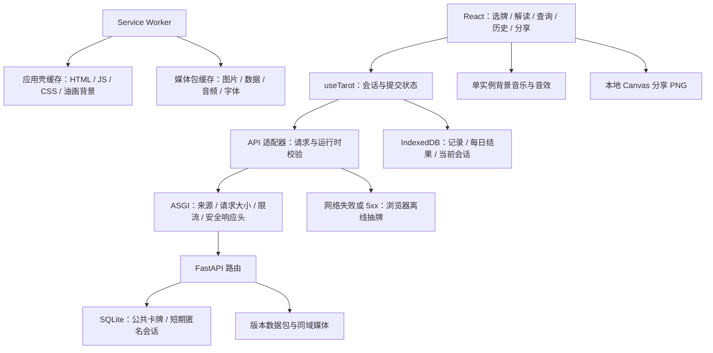
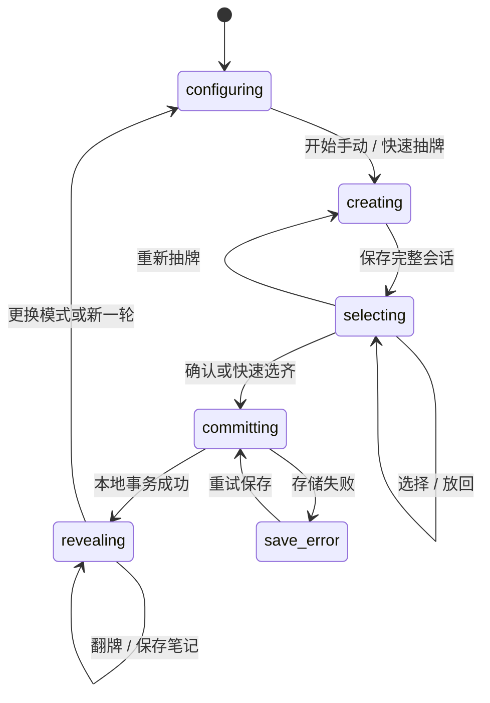

# 系统架构

版本：1.2｜日期：2026-10-01｜描述当前本地应用；公网部署尚未完成。

## 1. 架构总览



Python 提供公共数据、在线抽牌和静态文件；浏览器负责交互、个人数据、分享导出和离线抽牌。两端采用同一洗牌与搜索契约，但独立随机会话不要求产生相同结果。

## 2. 技术选择与模块职责

| 部分 | 当前实现 | 职责 |
|---|---|---|
| HTTP 服务 | FastAPI / Uvicorn | 路由、异常转换、媒体与构建文件 |
| 接口边界 | Pydantic + 纯 ASGI 中间件 | 严格参数、来源检查、请求体限制、限流、安全头 |
| 服务端持久化 | SQLite | 卡牌 JSON、24 小时匿名会话和请求幂等 |
| 网页 | React / TypeScript / Vite | 页面、状态、动画与正式资源构建 |
| 本地数据 | IndexedDB | meta、readings、daily_results 三个 store |
| 离线资源 | Service Worker / Cache Storage | 应用壳与媒体隔离、下载校验、音频 Range |
| 素材生成 | Python / Pillow，Mac afconvert | 压缩图片、音轨提取、数据包与 SHA-256 清单 |
| 分享 | Canvas | 中世纪油画背景、可排序组件、1200 px PNG |

业务分层保持简洁：路由在 main.py，存储在 repository.py，参数在 schemas.py，随机和搜索在 rules.py，边界保护在 security.py。没有提前建立多层服务目录，也未引入全局状态库、Redis 或消息队列。

## 3. 数据与隐私边界

公共数据源是 `backend/content/cards.json`；启动时将卡牌导入 SQLite，牌阵和版本信息保留在数据集对象。浏览器加载完整数据集供本地查询，在线 API 同样支持搜索。

创建会话仅上传 request_id、牌组、版本、模式、数量及逆位设置。问题、笔记、每日结果、历史和分享图片均在当前浏览器处理。后端匿名会话仅用于重试，不是个人记录服务。

历史保存卡牌文本和可选高清 Blob。结果摘要保留旧快照；详情与完整解读优先使用当前图鉴对应卡牌，缺失时回退。图片 URL 带哈希，新素材不原地覆盖旧路径。

## 4. 抽牌、保存与恢复

在线和离线都先生成完整的 78 张洗好牌组，并固定每个 slot 的 card ID 与方向。前端展示牌背，以 selected 的有序 slot ID 对应牌位。快速抽取取前 N 个 slot；手动选牌可以取消和重新选择，但不重新随机方向。

两端采用 Fisher–Yates；Python 使用 secrets.randbelow，浏览器使用 Web Crypto 与拒绝采样避免取模偏差。逆位为独立的 0–99 整数与概率比较，关闭或 0% 时全正位，100% 时全逆位。



configuring、creating、committing 是流程概念；实际 Work.phase 只保存 selecting / revealing，忙碌与洗牌另用界面状态表示。查询弹层和音乐开关不会清空会话。已保存选择、翻牌和笔记可以刷新恢复。

在线会话以 request_id 幂等：同 ID 同参数返回原响应，不同参数返回 409。SQLite 写事务处理并发，每次创建先清理过期会话，活跃上限为 10000。当前网页没有自动重放在线请求；遇到传输失败、超时或 5xx 时创建独立离线会话，4xx 和非法响应显示错误。网络恢复不替换当前牌组。

完整牌组包含 card ID，浏览器可以通过开发工具查看；这是个人探索工具，不提供防作弊或服务器隐藏开奖协议。

## 5. 每日结果的事务边界

每日键为 `deck_id:local_date`，当地日期依据设备日历计算。确认时，readings、daily_results 和 meta 在同一 IndexedDB 写事务中提交；多标签页竞争复用先提交的当天记录。只有事务成功后才允许揭晓。

删除历史不删除每日结果；改概率、刷新和再次开始每日模式都复用当天结果。页面跨午夜或从后台返回时重新检查日期，避免沿用昨天的结果。清除站点数据、更改系统日期或换浏览器无法由无账号架构跨设备约束。

## 6. 离线与更新

应用壳由 Vite 生成 app-shell.json，包含入口和带哈希构建资源；Service Worker 使用构建版本缓存。媒体由资源清单单独管理，不能覆盖应用壳中的脚本与样式。

下载流程如下：

1. 校验 manifest 的路径、版本、条目数、单项及总大小。
2. 估算空间并尝试申请持久存储；申请成功不代表浏览器永远不清理数据。
3. 顺序下载到带 bundle_version 的媒体缓存；已有条目也重新校验长度和 SHA-256。
4. 仅把校验成功字节计入进度，删除失败条目；暂停后可以继续修复。
5. 保存 ready / audio_ready；必需 core 条目全部完成且版本匹配才认定可离线使用。

当前没有额外 staging cache 或 active-bundle 指针表；状态保存在 meta.bundle。启动检查必需资源是否仍存在，缺失或数据版本不匹配则撤销 ready。旧媒体可用于历史，但不能当作新版资源已就绪。

| 请求 | Service Worker 行为 |
|---|---|
| 同源页面导航 | 优先网络；网络失败回退当前应用壳入口 |
| 非媒体静态资源 | 只在当前应用壳缓存查找，再请求网络 |
| `/media/` | 只在本站媒体缓存查找，再请求网络 |
| 带 Range 的缓存媒体 | 返回合法单区间 206 或非法区间 416，支持离线音频 |
| `/api/`、非 GET、跨源、cache:reload | 不接管，由应用适配器或网络处理 |

新版本在首页提示更新，不在抽牌时强制刷新；激活时删除旧应用壳。清理媒体包不会删除个人记录，清理个人记录也不会删除公共数据。后端目前只提供当前数据版本，不承诺历史版本 API 保留。

## 7. 实际代码目录

```text
Tarot/
├── start.command                  # Mac 构建、启动与打开浏览器
├── agent.md / docs/               # 维护约定、产品与实现文档
├── assets/ / design/              # 原始素材、牌背及设计记录
├── backend/
│   ├── app/
│   │   ├── main.py                # 路由、错误响应、静态路径边界
│   │   ├── security.py            # Host、来源、请求体、限流与 CSP
│   │   ├── repository.py          # SQLite、幂等与会话容量
│   │   ├── schemas.py / rules.py   # 严格参数、搜索与随机规则
│   │   └── settings.py            # 路径与环境配置
│   ├── content/                   # 卡牌、牌义源文件与生成数据
│   ├── migrations/001_init.sql    # 当前数据库结构
│   ├── scripts/prepare_assets.py  # 素材与清单生成
│   └── tests/                     # 功能与攻击回归
├── frontend/
│   ├── src/
│   │   ├── App.tsx / main.tsx     # 路由、应用入口与注册离线服务
│   │   ├── features/             # 页面、useTarot、解读与分享编辑
│   │   ├── domain/               # 类型、规则、解读、运行时校验
│   │   ├── adapters/             # API 与 IndexedDB
│   │   ├── components/ / audio/  # 控件、玻璃菜单与声音
│   │   ├── export/               # 分享组件、Canvas 与油画背景
│   │   └── pwa/                  # 离线包下载与校验
│   ├── public/sw.js              # 应用壳、媒体缓存与 Range
│   └── tests/                    # 浏览器功能与安全回归
├── shared-contracts/              # 两端随机测试向量
├── media/                         # 生成后的不可变资源与清单
└── var/                           # 本地 SQLite，运行时生成
```

数据库迁移目前仅有版本 1 建表脚本和版本表，没有自动回滚功能。后续更改结构前需要备份并设计迁移，不能用删库代替升级。

## 8. 接口保护与部署

默认绑定 127.0.0.1，同源提供 API、媒体与网页。后端仅让首页、draw、cards、history、settings 回退到 index.html；未知文件返回 404，真实路径必须处于 frontend/dist 内。

安全中间件检查 Host、Origin 和 Fetch Metadata，限制 URI、请求体、接收时间、频率；默认关闭 API 文档，响应设置 CSP、nosniff、禁止嵌入和 API no-store。环境变量和已验证攻击场景见 [安全审查](10-security-review.md)。CSP 允许 style 的 unsafe-inline，以支持动态布局；不是对所有注入情形的绝对保证。

公网部署需 HTTPS、精确域名白名单与受信反向代理配置。限流状态在进程内，多实例需由代理或共享服务统一执行。当前未实现账号、跨设备同步或 AI 接口；扩展时再明确数据上传和鉴权边界。

运行命令见 [README](../README.md)，接口字段见 [数据与 API](03-data-and-api.md)，实际验证范围见 [实现与验证](08-implementation-and-validation.md)。
