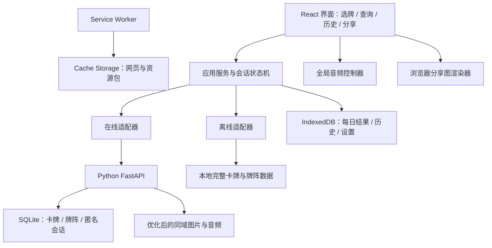
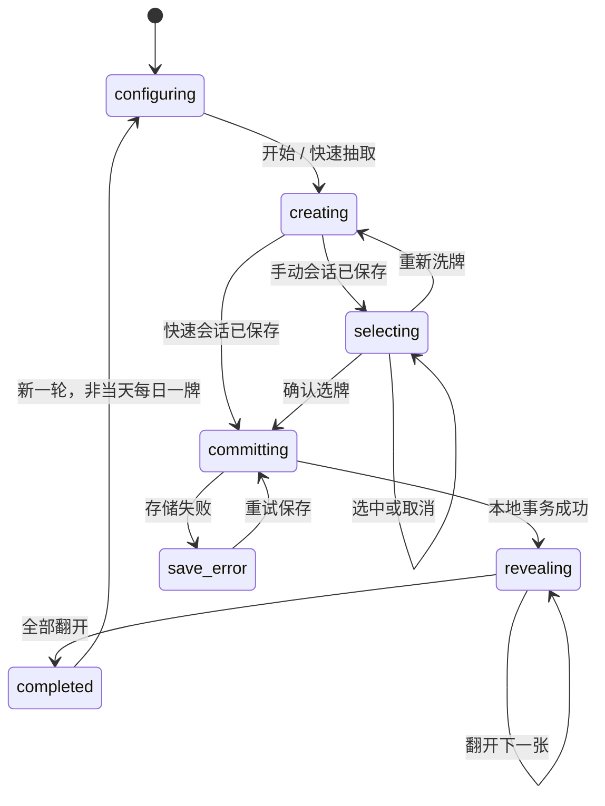

# 系统架构设计

版本：1.1｜日期：2026-09-30｜第一版本地实现已建立，运行方式见根目录 README

## 1. 架构总览



Python 后端是在线业务与公共数据来源。React 负责交互。为了支持完全断网，浏览器保留抽牌算法和查询算法的离线实现；两端遵循同一数据契约与测试样例。相同规则不代表不同时间启动的两个会话必须抽出相同随机结果。

## 2. 技术选择与职责

| 部分 | 选择 | 说明 |
|---|---|---|
| 后端语言 | Python | 用户明确要求 |
| Web 框架 | FastAPI | JSON API、类型校验、OpenAPI，按路由与服务拆分 |
| 数据校验 | Pydantic | 校验抽牌数量、概率、模式、版本及响应结构 |
| 后端启动 | Uvicorn / ASGI | 单服务起步，部署时运行受管理的 Python 进程 |
| 服务端持久化 | SQLite | 小规模公共数据与短期匿名会话，无跨设备个人数据 |
| 前端 | React + TypeScript + Vite | 用户已选择；版本在开发开始时核查、锁定 |
| 客户端存储 | IndexedDB | 异步保存结构化数据和素材缩略快照 |
| 离线 | Service Worker + Cache Storage | 网页与媒体缓存、下载进度、版本切换 |
| 图片处理 | Python + Pillow | 实施阶段生成缩略图、展示图、哈希和 manifest |
| 分享图 | 浏览器 Canvas | 同域图片和本地字体，客户端生成 PNG |
| 声音 | 浏览器音频控制器 | 一个背景播放器、独立音效通道 |

后端使用 FastAPI 的路由组织方式；卡牌、牌阵、抽牌及资源各有独立模块，业务规则不写在页面里。[FastAPI 多模块文档](https://fastapi.tiangolo.com/tutorial/bigger-applications/)

IndexedDB 适合保存本项目的结构化客户端数据。Cache Storage 保存请求对应的网页和媒体资源，两者分工明确。[IndexedDB 官方说明](https://developer.mozilla.org/en-US/docs/Web/API/IndexedDB_API)

## 3. 数据边界

| 数据 | 服务端 | 浏览器 | 是否上传个人内容 |
|---|---|---|---|
| 卡牌、牌义、牌阵 | SQLite 主数据；版本化 JSON 发布 | 完整本地副本 | 公共资料 |
| 原始素材 | 项目素材目录 | 不整体下载原始 JPG | 无 |
| 展示素材 | 同域静态媒体 | 离线包缓存 | 无 |
| 在线洗牌会话 | 短期持久化响应，供请求重试 | 会话快照 | 只有匿名规则参数，无问题笔记 |
| 离线洗牌会话 | 无 | 本地生成与保存 | 无 |
| 每日一牌、历史、笔记 | 无个人存储 | IndexedDB | 不上传 |
| 设置与音频开关 | 无个人存储 | IndexedDB | 不上传 |
| 分享图片 | 无 | 临时生成，用户下载 | 不上传 |

匿名会话不使用账号、跨设备 ID 或用户指纹。服务器访问日志可能记录普通请求元数据；应用不主动将问题或笔记放入请求、URL或日志。

## 4. 抽牌会话设计

### 4.1 创建与选牌

在线开始时，Python 根据模式、数量、逆位开关、概率和数据版本创建一个完整的 78 张洗好牌组，并为每个位置固定方向。返回稳定 slot ID、卡牌 ID 和方向。前端只显示背面，按 slot ID 接受选择。

手动选牌时，前端记录 `selected_slot_ids` 的顺序。确认时，将对应 card ID 和方向写入本地记录；之后不再请求随机接口。快速抽取直接取当前洗好牌组的前 N 个 slot。

服务器返回的完整牌组会被浏览器获得；本项目是个人工具，不承诺防篡改、服务器隐藏牌面或对抗作弊。无需为此增加提交签名、账户或复杂开奖协议。

创建离线会话使用已缓存的相同 78 张牌组与相同模式配置，生成同形状的会话对象。某个会话创建后，以它的快照为准，选牌、查询、翻牌和分享不再依赖网络。

### 4.2 随机规则

- 两端采用 Fisher–Yates 对完整牌组洗牌，不用随机比较函数排序。
- Python 使用系统随机源；浏览器使用 Web Crypto 随机整数，并使用拒绝采样避免整数区间的取模偏差。
- 每张牌独立生成 0–99 的整数，逆位开启且整数小于概率值时为逆位。
- 概率为 0、100、关闭逆位的行为明确；每轮相同 card ID 不重复。
- 选牌顺序就是牌阵位置顺序。不要把随机选中的集合再按原始字典次序过滤输出。

两端共用 JSON 格式的算法测试向量和注入随机源测试。测试向量覆盖洗牌输入、交换索引序列、方向随机值与期望输出，验证算法和边界规则一致；不要求 Python 与浏览器系统随机流完全一致。

### 4.3 状态机



查询弹层和音频开关作为独立状态，不使抽牌状态机重置。会话、选牌顺序和翻牌状态落盘后，刷新可以恢复。只有当前一次生成操作的响应可以进入状态机；过期响应被丢弃。

### 4.4 网络失败与重试

客户端在创建前生成 `request_id`。服务器以它作为幂等键，在 SQLite 中保存请求参数摘要和生成结果；同 ID 同参数重试返回相同结果，同 ID 不同参数返回 409。会话保留 24 小时并定时清理，不用进程内全局列表实现幂等。

请求超时后，如果已有可用本地数据，前端可以采用离线适配器创建本轮，使用独立的离线 session ID 并标记 source。接受离线会话时取消在线请求并增加 generation 标识；原在线响应即使迟到也不覆盖本地会话。服务器短期保留的旧响应随后自动清理。

网络恢复不重新洗牌，也不将离线历史上传。下一轮可重新尝试在线适配器。网络判断以真实 API 请求为准，`navigator.onLine` 仅做提示；其值不能证明服务器可达。[MDN onLine 说明](https://developer.mozilla.org/en-US/docs/Web/API/Navigator/onLine)

## 5. 每日一牌与本地事务

每日结果的约束放在浏览器，避免引入身份系统。开始前检查 `(deck_id, local_date)`；用户确认选择时，用一个 IndexedDB 事务同时完成每日唯一索引、记录快照和会话确认。

重复点击禁用按钮；多标签页即使同时开始，唯一索引确保只保存一个当天结果。提交失败的页面读取已存在结果并展示。记录保存发生在首张翻开前，保证出现过的每日结果已经持久化。

历史删除与每日索引独立。每日索引保留足够的结果快照，使删除历史后仍能恢复当天牌。日期改变才使用新的键；更改系统日期、清除站点数据和不同浏览器的结果无法通过无账号的本地架构强制约束。

## 6. 查询和公共数据发布

卡牌资料在开发时维护为可审核的 UTF-8 结构化源文件，Python 导入并校验 SQLite；发布时生成不可变的完整数据包。SQLite 是运行时在线查询来源，版本数据包是离线副本，不由前端再独立维护一份不同牌义。

单个版本只有 78 张牌，在线可通过数据库读取后使用共享规范搜索，离线直接查内存中的完整数组。名称、别名、关键词、牌义按明确规则归一化；分类筛选与查询相交。排序契约详见数据文档。

卡牌名称和图片 ID 稳定，数据版本、素材版本和应用版本分开管理。内容更新不会重算每日结果；历史保存当时的牌义快照，避免编辑牌义后旧笔记上下文悄然改变。

## 7. PWA 与离线包

### 7.1 包结构

核心包：应用 HTML / JS / CSS、离线页、78 张展示牌面、全部缩略图、牌背、本地字体、完整中文牌义和牌阵。音频扩展包：背景音乐及两种音效。

Service Worker 使用安全上下文运行；生产使用 HTTPS，本地开发可使用 localhost。资源缓存可以支持离线访问。[Service Worker 说明](https://developer.mozilla.org/en-US/docs/Web/API/Service_Worker_API)

### 7.2 下载与校验

1. 获取 manifest，展示总大小与资源数量。
2. 检查空间估算，申请持久存储作为尽力措施。
3. 有限并发下载到带版本号的 staging cache，记录每个条目的状态。
4. 校验 URL、响应成功、SHA-256、字节数和数据包结构。
5. 必需项全部完成后，在 IndexedDB 中切换 active bundle 指针。
6. 失败保留已验证条目，显示失败项，可继续下载；不能把部分缓存标记为 ready。

下载可以暂停或取消。应用在没有 active bundle 时依靠在线服务运行；网络失败时展示资源未准备的提示，不尝试生成缺卡的离线牌组。

浏览器存储受空间和清理机制影响，持久存储申请可能不获准。每次启动验证核心资源存在，缺失就撤销 ready 标志并提供修复下载，不把 PWA 安装成功视为资源永远可用。[存储配额与清理说明](https://developer.mozilla.org/en-US/docs/Web/API/Storage_API/Storage_quotas_and_eviction_criteria)

### 7.3 缓存策略

| 资源 | 策略 |
|---|---|
| 带哈希 JS / CSS / 字体 / 图片 / 音频 | Cache First；版本化 URL |
| HTML 导航 | 优先网络，失败回退应用壳；不拦截 API 错误为 HTML |
| manifest / 当前版本信息 | Network First，已有版本可回退 |
| 完整版本数据包 | 不可变 URL，完整下载后使用 |
| POST 抽牌会话 | 不缓存 HTTP 请求，不做后台排队重放 |
| GET 查询 API | 在线获取；失败由应用查询适配器使用完整本地数据 |

更新下载完成后在空闲页面提示切换，不在选牌、翻牌或导出时强制刷新。当前会话绑定数据包版本，完成前保留其资源。服务端保留当前与上一个完整数据版本至少 24 小时，支持已开始会话和重试；客户端历史保留文本和缩略图快照。

核心包与音频包分别标记 ready。清除离线资源不删除个人记录；清除个人记录不破坏缓存和卡牌数据。

## 8. 代码组织

第一版实际目录见根目录 [README.md](../README.md) 和 [agent.md](../agent.md)。后端将路由、数据校验、规则和持久化分为四个模块；不为 78 张小数据集提前建立多层服务目录。下方树形结构保留为未来按规模拆分的参考。

```text
Tarot/
├── docs/                     # 本次实际交付
├── assets/                   # 已有原始素材，保留
├── backend/                  # 后续实施
│   ├── app/
│   │   ├── main.py
│   │   ├── api/               # cards / spreads / sessions / resources
│   │   ├── schemas/           # 请求与响应
│   │   ├── services/          # 抽牌 / 搜索 / 资源发布
│   │   ├── repositories/     # SQLite 访问
│   │   └── settings.py
│   ├── content/               # 卡牌、牌义、牌阵审核源
│   ├── migrations/
│   ├── scripts/               # 素材处理、内容导入、版本发布
│   ├── tests/
│   └── pyproject.toml
├── frontend/
│   ├── src/
│   │   ├── app/               # 路由 / provider / 全局控制器
│   │   ├── features/          # draw / search / library / history / settings
│   │   ├── domain/            # 类型、规则、会话状态机
│   │   ├── adapters/          # 在线 / 离线 / IndexedDB
│   │   ├── components/
│   │   ├── audio/
│   │   ├── export/
│   │   └── pwa/
│   └── package.json
├── shared-contracts/          # JSON schema / 测试向量
└── media/                     # 后续生成的不可变展示资源
```

不预先引入全局状态库、Canvas 动画框架、Redis 或消息队列；实施时仅在实际交互和性能需要时选型。SQLite 迁移脚本使用版本表并可回滚，不自动覆盖线上数据。

## 9. 部署与运维

起步采用同域部署：`/api/v1` 进入 FastAPI，`/media` 提供不可变媒体，其他前端路由回退网页入口。Python 可以提供构建后的静态文件，媒体量或流量增加后再由反向代理服务静态资源。[FastAPI 静态文件文档](https://fastapi.tiangolo.com/tutorial/static-files/)

构建时用 Node 工具生成 React 静态包；运行时主要服务为 Python。数据库和媒体使用持久目录，日志不包含个人问题笔记。发布流程为校验内容 → 生成素材与 manifest → 导入数据版本 → 构建前端 → 本地验收 → 部署 Python 和静态资源 → HTTPS 下验收 PWA。

提供 `/health` 健康检查。首次先用单实例，SQLite 事务与唯一约束处理会话请求。未来需要多实例或大量写入时，再迁移公共数据库到 PostgreSQL；Redis 并非第一版必需。

## 10. 架构决策记录

| 决策 | 理由 | 代价 |
|---|---|---|
| Python + FastAPI | 满足后端语言要求，便于以后增加 AI 服务 | 比纯静态站需要维护服务进程 |
| React 保留 | 已确认交互技术，动画与 PWA 在浏览器完成 | 需要前端构建环境 |
| SQLite 公共数据，IndexedDB 私人数据 | 无账号、设备独立、断网可写笔记 | 无跨设备恢复或同步 |
| 双抽牌与查询适配器 | Python 在线服务与离线需求同时成立 | 必须做两端契约与规则一致性检查 |
| 会话先生成后选择 | 手动选牌能断网继续，方向和牌不反复随机 | 浏览器能看到完整牌组，个人场景可接受 |
| 使用现有素材 | 遵循用户选择，形成统一原始素材来源 | 需要展示尺寸转换，素材出处资料待补 |
| 第一版固定牌义 | 不依赖模型费用或 API，可完全离线 | 不根据问题自动生成个性化解读 |

未来 AI 由 Python 接口接收用户主动提交的问题和已抽出的明确 card ID、方向、位置；模型负责解释，不重新抽牌。第一版不设置 AI 调用入口。
